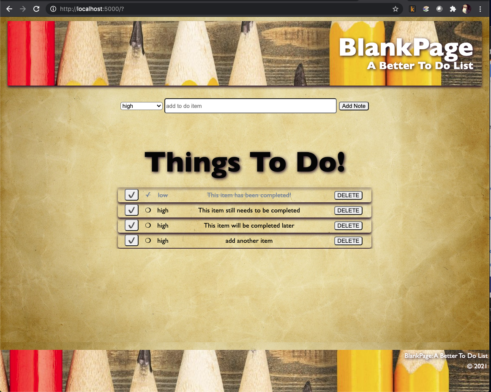

# Project Name

[Project Instructions](./INSTRUCTIONS.md), this line may be removed once you have updated the README.md

## Description

    Duration: Weekend Project

    The project challenge was to create a To Do List App that allowed the user to input a note and see that note added to their list. Once on the list, the user needed to be able to mark that note as completed and be able to delete that note. All of this needed to be saved to a database so that the notes would remain on the screen until the user deleted them. 

    I created a simple but aesthetically pleasing page that in addition to allowing the user to input a note, they could also choose a priority for that note from a dropdown menu (high/low).

    The notes were appended on the page below under a large header that simply said "Things To Do!"

    Each item has a task completed button on the left, that when clicked will include a checkmark next to the item and put a line through the text on the line. On the right is a DELETE button to remove the item.

## Screen Shot

    

### Prerequisites

    ●  Node.js
    ●  Postico

## Installation

This project is currently hosted on a local server. To get this project up and running:

- 1.  Create a database (weekend-to-do-app) in Postico
- 2.  The queries necessary to reproduct the table and initial insert data are included
        in database.sql
- 3.  Open your editor and run in terminal: npm install, npm install express, 
        npm install pg
- 4.  Run npm run server in your terminal
- 5.  Run npm run client in your terminal (this will open a new browser tab for you)

## Usage

- 1.  Select High or Low Priority from the dropdown.
- 2.  Enter the text for your note in the input field.
- 3.  Click "Add Note" to add your note to the list.
- 4.  See your note in the To Do List!
- 5.  When a task is completed, click the check button on the left.
        Notice how a satisfying check mark is added next to your list item
        and how the list item is now crossed off.
- 6.  When you're ready to remove the item from your list, click "Delete" on the right!

## Built With

JavaScript, jQuery, CSS, HTML, SQL (Postico/ Postgres)

## Acknowledgement

Thanks to Prime Digital Academy who equipped and helped me make this application a reality. Special thanks to Chris Emerfoll, Collin Radichel, and Mike Dunn for looking through my code, helping me find the problem pieces of code and talked me through methods to fix them.

## Support

If you have suggestions or issues, please email me at trohde@rocketmail.com

